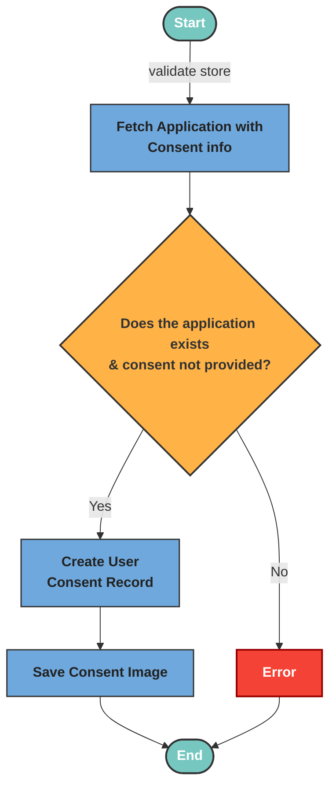

# Apply Consent

The applyConsent Logic validates the store ID and checks the applicant’s consent status, ensuring consent hasn’t been previously submitted. It converts the submitted base64 signature image into a buffer, creates a new consent record linked to the application, and saves the signature image.

