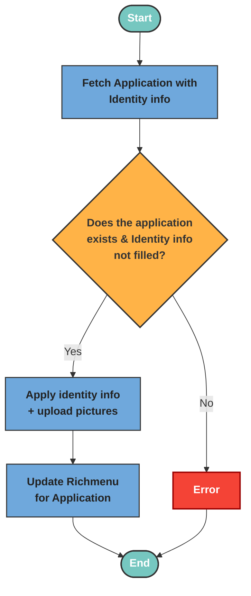

# Apply Consent

The applyIdentity Logic processes the submission of identity verification documents by validating the uploaded files and types, retrieving the related application, and ensuring identity info hasn’t already been completed. It then saves the identity images and updates the LINE rich menu.

