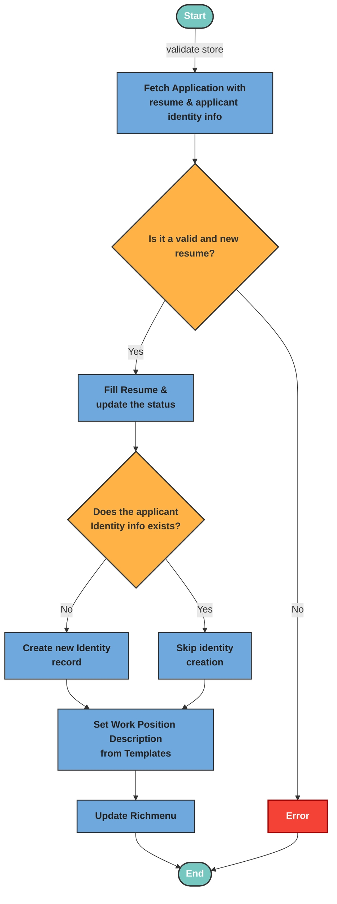

# Apply Resume

The applyResume Logic validates the store ID and resume data, fetches the application with resume and identity info, and ensures the resume is still editable. It then processes the resume picture (uploading or reusing), fills in resume details, updates the status, creates identity info if missing, sets work position descriptions from templates, and lastly updates the LINE rich menu based on the status of the resume.

