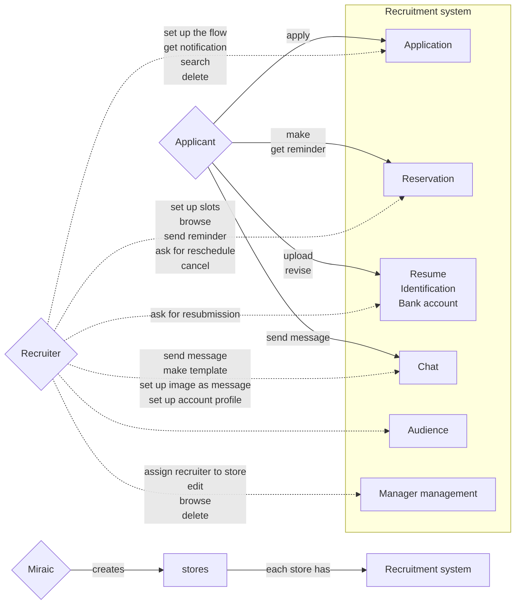
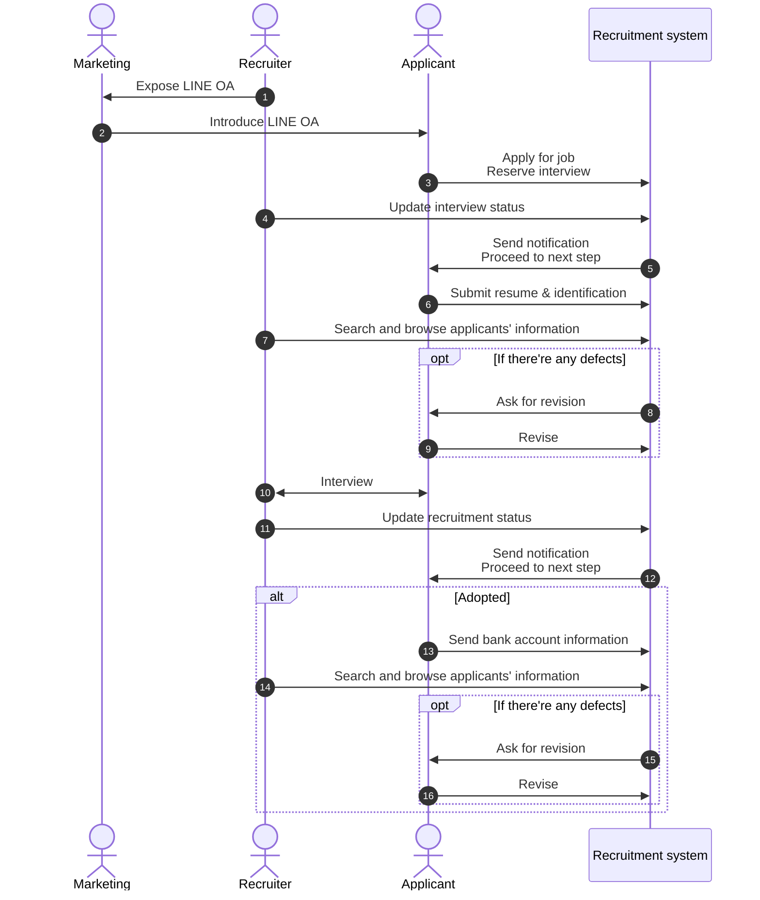

# Functional Design

## Use Case Diagram

### [Click here](https://miraic1201.backlog.com/document/DI_SYSTEM_TEAM_SPACE/01979b9105cd74c1908a8091bed0ee1b) to know how to add a store

## Sequence Diagram

##　Screen Design

### List of Screens

#### Current screen design; https://www.figma.com/design/SeWAdyYpt4HuiHaliaVqy6/RecruitmentSystem?node-id=0-1&p=f&t=YeKk98j8cqk6rrh4-0

## Sample Table

| Name of Screen  | Description                      | Date of of latest update    |
|-----------------|----------------------------------|-----------|
| Mermaid Support | Render diagrams inside MDX files | Working   |
| Tables          | Standard Markdown tables support | Works fine|
| Blog            | Blogging with reading time       | Enabled   |
