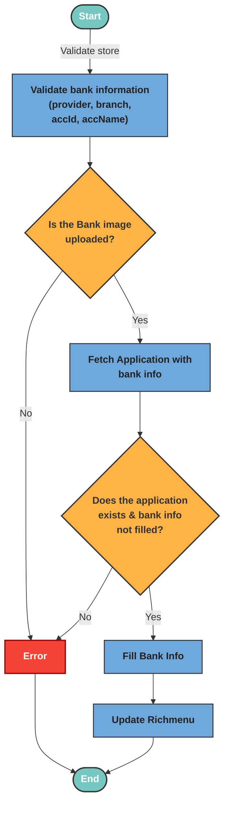

# Apply Koza

The applyKoza logic validates the store ID and bank account (koza) information, including a required image, then fetches the related application and ensures the koza data is not already completed. It applies the submitted koza details and image to the application, updates the LINE rich menu accordingly.

