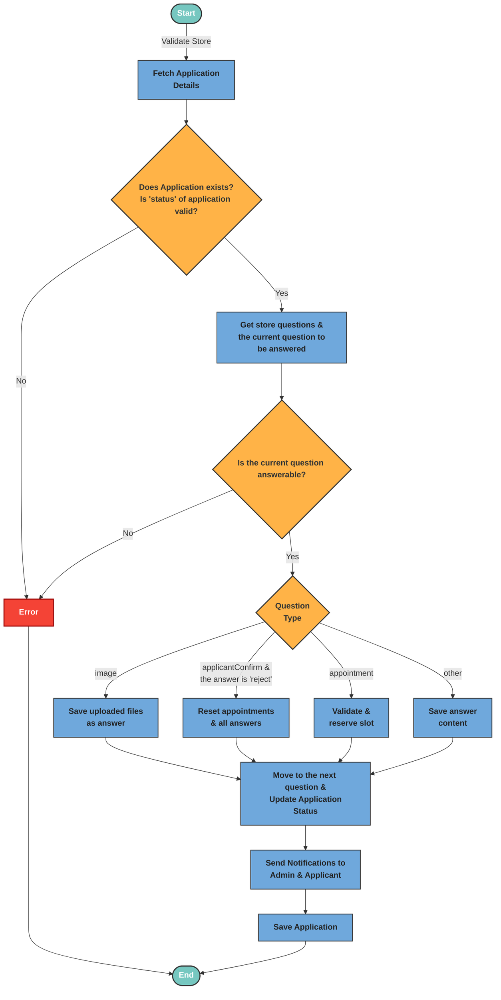

# Apply Question

The logic handles an applicant’s response to a store-specific question by first validating the request, identifying the current question in the flow, then saving the answer based on its type (e.g., image, appointment, confirmation), updating the application’s status or resetting it if rejected, and finally sending notifications to the applicant and/or admins as needed.

